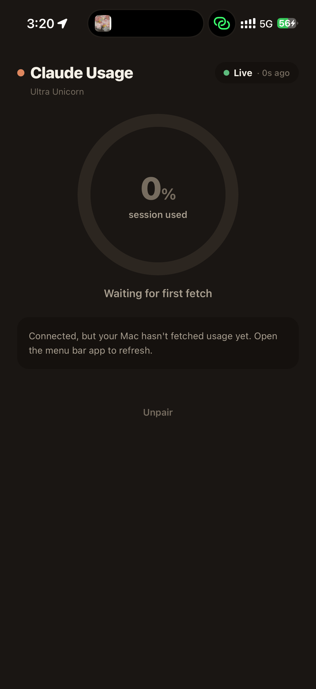
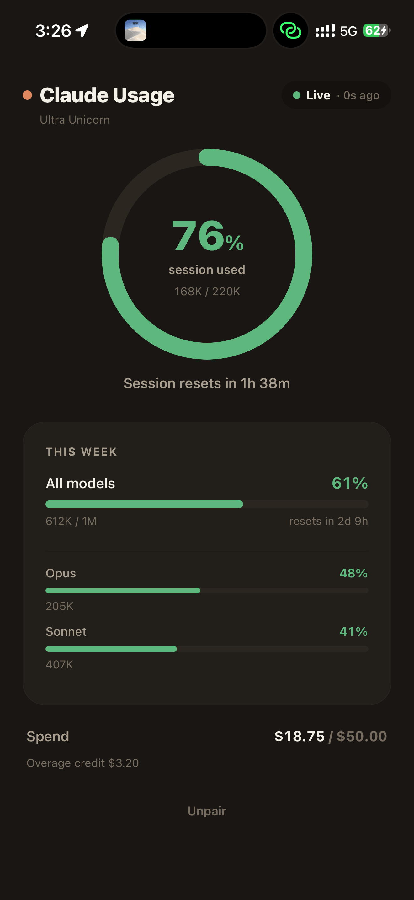

# Claude Usage — Mobile

A companion mobile app for [Claude Usage Tracker](https://github.com/hamed-elfayome/Claude-Usage-Tracker).
View your Claude Code session/weekly usage on your phone, served by the Mac menu bar app over your local network.

> Your Claude session key never leaves your Mac. The phone only reads the
> derived usage numbers from the Mac's local server — it never authenticates
> to Claude directly.

## Screenshots

| Pair | Connected | Dashboard |
|:----:|:---------:|:---------:|
|  |  |  |

## Features

- **Session ring** for the 5-hour window, with live "resets in" countdown.
- **Weekly breakdown:** all-models, Opus, and Sonnet, each with token counts and its own status color.
- **Spend** against your limit, plus overage credit.
- **Connection status:** Live / Stale / Offline, with cached data shown instantly on launch.
- **Home & Lock Screen widgets** (small / medium / large + accessory) via `expo-widgets`.
- **Live Activity** for the active session (Dynamic Island + Lock Screen), toggleable in Settings.
- **Local notifications** when your session runs low or resets.

## How it works

```
Claude API ──sessionKey──▶ Mac app (LocalServerService, opt-in)
                                │  GET /v1/usage  (Bearer token, read-only)
                                ▼
                          This app  (over LAN / Tailscale)
```

1. In the Mac app: **Settings → Mobile App → Enable companion server**.
2. A QR code appears encoding `{ host, port, token }`.
3. In this app, tap **Scan QR** (or **Enter manually**) and pair.
4. The dashboard shows session, weekly, Opus, Sonnet and spend, refreshing
   every 30s and on pull-to-refresh.

The Mac must be awake and on the same network (or reachable via Tailscale).

## Wire contract (`GET /v1/usage`)

```jsonc
{
  "apiVersion": "v1",
  "serverTime": "2026-05-22T00:00:00Z",
  "profileName": "Default",
  "hasData": true,
  "usage": {
    "sessionTokensUsed": 142000, "sessionLimit": 220000,
    "sessionPercentage": 64.5, "sessionResetTime": "2026-05-22T02:05:48Z",
    "weeklyTokensUsed": 540000, "weeklyLimit": 1000000,
    "weeklyPercentage": 54.0, "weeklyResetTime": "2026-05-25T00:35:48Z",
    "opusWeeklyTokensUsed": 120000, "opusWeeklyPercentage": 31.0,
    "sonnetWeeklyTokensUsed": 420000, "sonnetWeeklyPercentage": 42.0,
    "costUsed": 12.4, "costLimit": 50.0, "costCurrency": "USD",
    "lastUpdated": "2026-05-21T23:35:48Z",
    "userTimezone": { "identifier": "America/New_York" }
  }
}
```

All requests require `Authorization: Bearer <token>`. Unknown paths → 404,
bad/missing token → 401.

## Pairing via deep link

As an alternative to QR scanning:

```
claudeusagemobile://pair?host=192.168.1.42&port=47600&token=<token>
```

## Develop

Built with **Expo SDK 56**: expo-router, expo-camera, expo-secure-store,
expo-widgets, expo-notifications, expo-haptics, react-native-svg, and
@expo/ui (SwiftUI) for the widgets and Live Activity.

```sh
npm install
npx expo run:ios      # or: npx expo run:android
```

A development build is required (not Expo Go) because pairing relies on the
local-network ATS exception and camera config baked in at build time.
