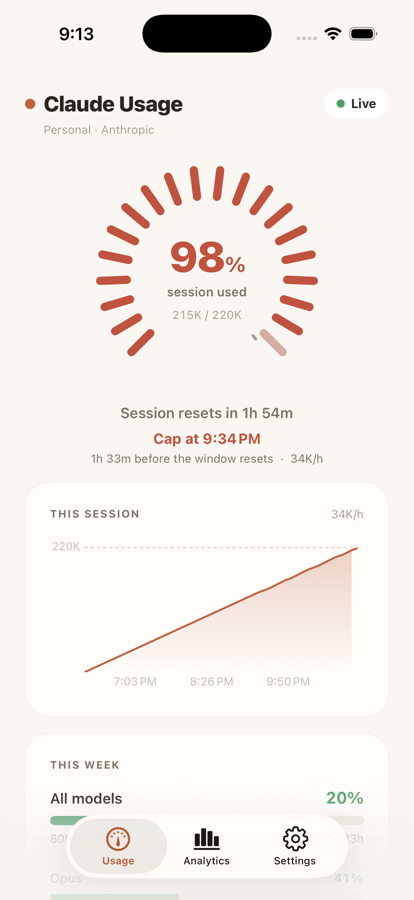
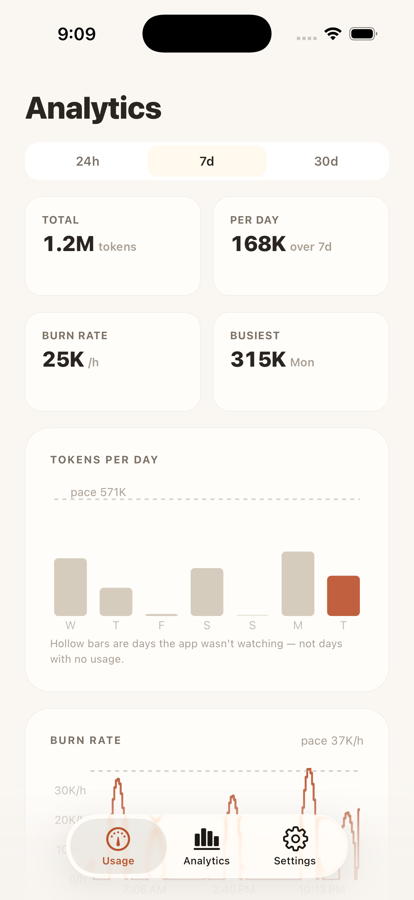
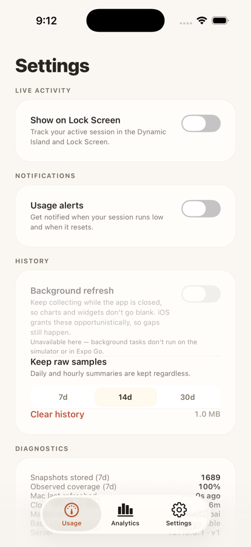
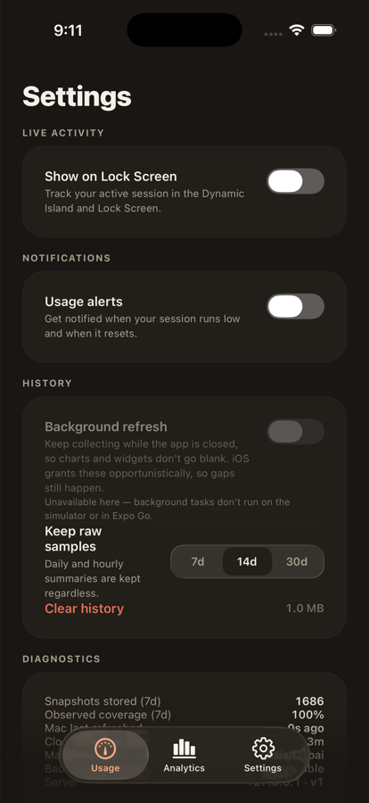
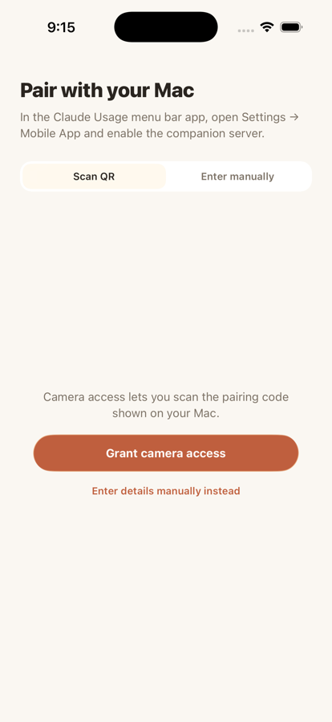

# Claude Usage — Mobile

A companion mobile app for [Claude Usage Tracker](https://github.com/hamed-elfayome/Claude-Usage-Tracker).
See your Claude Code usage on your phone — and, because the phone keeps its own
history, see where it's *heading*.

> Your Claude session key never leaves your Mac. The phone only reads the
> derived usage numbers from the Mac's local server — it never authenticates
> to Claude directly.

## Screenshots

| Usage | Analytics | Settings | Dark | Pair |
|:-----:|:---------:|:--------:|:----:|:----:|
|  |  |  |  |  |

*Captured on iOS 26, where the tab bar, pills, buttons and segmented controls
are real Liquid Glass.*

## Why there's a history layer

The Mac serves a **point-in-time snapshot** and nothing else — no history, no
per-profile routes. So every chart here is built from history the phone
accumulates itself: one SQLite row per *distinct* Mac snapshot, plus the
classified interval between it and its predecessor.

That constraint shapes everything:

- **Deduplication is on `lastUpdated`, not poll time.** The Mac refreshes far
  more slowly than the app polls, so most polls repeat a snapshot. Without the
  dedupe you get 20-40× the rows and, worse, zero-length intervals that divide
  by zero in the burn rate.
- **Intervals are classified once, at insert**, while both samples are in hand.
  A counter that resets is not a negative delta; a negative reaching a `SUM()`
  silently cancels real usage on other days.
- **Coverage travels with every aggregate.** A day with full coverage and zero
  tokens ("I didn't work") and a day with no samples ("the phone was off") both
  come out of a naive query as `0`. Rendering them identically is the most
  common way this class of chart lies, so they get different marks — and days
  the app genuinely wasn't watching render as hollow ghosts.
- **Tokens whose timing is unknown stay unattributed.** Come back after three
  days offline and one sample carries days of consumption. Attributing it to
  the return day fabricates a record-breaking day; spreading it fabricates 3am
  usage. It counts toward the week and enters no day or hour bar.

## Features

**Usage**
- Radial tick gauge for the 5-hour window, with a second marker showing where
  the window is *projected* to land.
- **Projection line** — "on track for 71% at reset", "cap at 8:20 PM, 1h 14m
  before the window resets", or an honest "collecting usage" when there isn't
  enough history yet. When the fast and slow estimates disagree it reports a
  range rather than false precision.
- **Session burn-down** — an area chart from the window's start to its reset,
  *including the future*, with the limit line and a dashed projection ray. The
  empty space to the right is the runway; that's the point.
- Weekly meters for all models, Opus, Sonnet, Design and Fable, a 7-day bar
  chart with a sustainable-pace line, and a normalised model split.
- Spend, overage credit, and Codex plan/credits when the provider reports them.

**Analytics** (24h / 7d / 30d)
- Totals, per-day average, burn rate, and busiest day.
- Tokens per day, scrubbable with haptics — the value reads out in the card
  header, above your hand, not under it.
- Burn rate as a **stepped** line (a per-interval rate is piecewise-constant by
  construction) with real breaks at gaps, aggregated as the range widens.
- Absolute stacked model split per day; hour-of-day profile with a coverage
  strip; this-week-vs-last cumulative overlay; per-window session peaks.
- A permanent data-quality footer. It's what makes everything above it
  trustworthy.

**Everywhere**
- **Liquid Glass on iOS 26** — the system's own floating glass tab bar (which
  minimises as you scroll), plus glass status pills, buttons and segmented
  controls via `expo-glass-effect`. The tab bar deliberately sets no
  `backgroundColor` and no explicit `blurEffect`: either one swaps the glass
  material for a flat fill, which is how apps opt out of Liquid Glass by
  accident. Every glass surface is gated on `isGlassEffectAPIAvailable()`
  (some iOS 26 betas crash rather than degrade) and on Reduce Transparency,
  and falls back to a solid surface off iOS.
- Home & Lock Screen widgets and a Live Activity (`expo-widgets` + `@expo/ui`).
- Local notifications: threshold crossing, window reset, and a **pace warning**
  that fires while there's still time to act on it.
- Opportunistic background refresh so history and widgets survive the app being
  closed.

## How it works

```
Claude API ──sessionKey──▶ Mac app (LocalServerService, opt-in)
                                │  GET /v1/usage  (Bearer token, read-only)
                                ▼
                          This app  (over LAN / Tailscale)
                                │  records each distinct snapshot
                                ▼
                          SQLite history ──▶ every chart
```

1. In the Mac app: **Settings → Mobile App → Enable companion server**.
2. A QR code appears encoding `{ host, port, token }`.
3. In this app, tap **Scan QR** (or **Enter manually**) and pair.
4. The dashboard refreshes every 30s and on pull-to-refresh.

The Mac must be awake and on the same network (or reachable via Tailscale).

## Wire contract (`GET /v1/usage`)

Mirrors `LocalServerService.swift` field-for-field. Two encoder details matter:
a nil optional is an **absent key**, never JSON `null`; and dates are ISO-8601
UTC with **no fractional seconds**.

```jsonc
{
  "apiVersion": "v1",
  "serverTime": "2026-09-01T15:11:18Z",
  "profileName": "Personal",
  "provider": "anthropic",          // or "codex" — Codex reports percentages only
  "hasData": true,
  "usage": {
    "sessionTokensUsed": 142000, "sessionLimit": 220000,
    "sessionPercentage": 64.5, "sessionResetTime": "2026-09-01T20:07:20Z",
    "weeklyTokensUsed": 540000, "weeklyLimit": 1000000,
    "weeklyPercentage": 54.0, "weeklyResetTime": "2026-09-05T15:07:20Z",
    "opusWeeklyTokensUsed": 120000, "opusWeeklyPercentage": 31.0,
    "sonnetWeeklyTokensUsed": 420000, "sonnetWeeklyPercentage": 42.0,
    "designWeeklyTokensUsed": 0, "designWeeklyPercentage": 0,
    "fableWeeklyTokensUsed": 0, "fableWeeklyPercentage": 0,
    "costUsed": 12.4, "costLimit": 50.0, "costCurrency": "USD",
    "lastUpdated": "2026-09-01T15:10:20Z",
    "userTimezone": { "identifier": "America/New_York" }
  }
}
```

All requests need `Authorization: Bearer <token>`. The server checks the method
first, then auth, then the route — so an unauthenticated request to an unknown
path returns 401, not 404.

`effectiveSessionPercentage` is a **computed** property on the Mac and never
crosses the wire: once `sessionResetTime` has passed the Mac's own UI reads 0%.
The app mirrors that rule so the two can't disagree.

## Pairing via deep link

```
claudeusagemobile://pair?host=192.168.1.42&port=47600&token=<token>
```

## Develop

Built with **Expo SDK 57** (React Native 0.86, Hermes V1): expo-router native
tabs, expo-sqlite, expo-background-task, expo-camera, expo-secure-store,
expo-widgets, expo-notifications, expo-glass-effect, `@tanstack/charts` and
`@expo/ui` (SwiftUI).

Bundle identifiers: `tech.mindzone.agentusage.ios` (widget extension
`.ios.widgets`, App Group `group.tech.mindzone.agentusage`) and
`tech.mindzone.agentusage.android`.

```sh
npm install
npm run typecheck     # app + tests
npm test              # 37 unit tests over the history math
npx expo run:ios      # or: npx expo run:android
```

Liquid Glass only renders on an **iOS 26+** device or simulator. On anything
older the same components fall back to solid surfaces, so run there when you
are checking the glass.

Cloud builds go through EAS (`eas.json`); `production` builds an APK on Android.

A development build is required (not Expo Go) — pairing relies on the
local-network ATS exception and camera config baked in at build time, and
background tasks are always `Restricted` in Expo Go.

**Simulators have no camera**, so there is no way to scan a pairing QR code on
one. For development, set the pairing in the environment instead — it is read
only under `__DEV__`:

```sh
EXPO_PUBLIC_PAIRING=192.168.1.42:47600:<token> npx expo start
```

See [`AGENTS.md`](AGENTS.md) for the version pins that must not drift.
